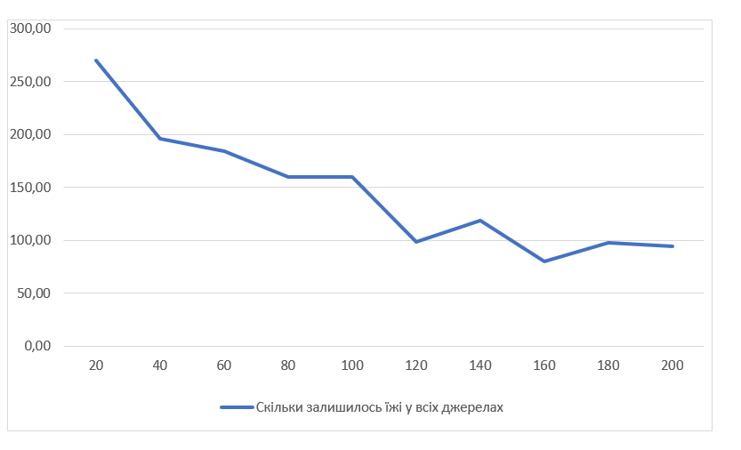
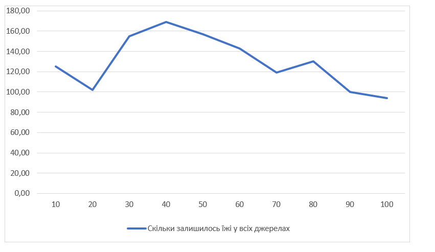
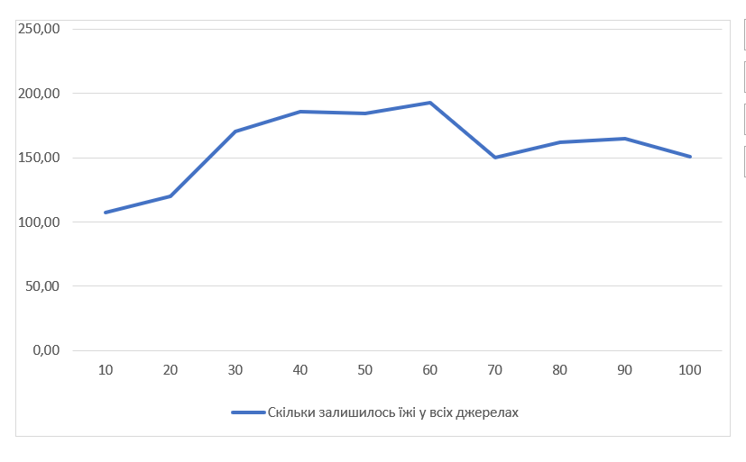

## Комп'ютерні системи імітаційного моделювання
## СПм-23-4, **Романенко Антон**
### Лабораторна робота №**1**. Опис імітаційних моделей та проведення обчислювальних експериментів

### Варіант 10, модель у середовищі NetLogo:
[Ants](https://www.netlogoweb.org/launch#http://www.netlogoweb.org/assets/modelslib/Sample%20Models/Biology/Ants.nlogo)

Ця модель симулює діяльність мурашиної колонії, спрямовану на ефективний збір харчів. Кожна мураха, що знаходить їжу, діє згідно з простими правилами, які забезпечують злагоджену роботу всієї колонії. Переносячи їжу до гнізда, мурахи залишають за собою слід феромонів. Інші мурахи, реагуючи на цей хімічний сигнал, слідують за слідом, щоб долучитися до збору їжі.

Основні параметри моделі:
population – задає чисельність мурашиної колонії. Діапазон значень: від 0 до 200.
diffusion-rate – визначає, як швидко і на яку відстань поширюються феромони. Діапазон: від 0 до 99.
evaporation-rate – контролює швидкість зникнення феромонів із середовища. Діапазон: від 0 до 99.
Внутрішні характеристики:
chemical – кількість феромону на певному патчі. Чим більше його значення, тим яскравішим і зеленішим стає патч.
food – вказує на кількість їжі на даному патчі (можливі значення: 0, 1, 2). Розподіл харчів здійснюється випадковим чином.
nest? – визначає, чи є конкретний патч частиною мурашиного гнізда (true – частина гнізда, false – інше).
nest-scent – числовий показник, який збільшується у напрямку до гнізда, допомагаючи мурахам орієнтуватися.
food-source-number – номер джерела їжі (1, 2 або 3), який використовується для ідентифікації різних запасів харчів.
Метрики ефективності:
На графіку відображається кількість залишків їжі в кожному джерелі, що дозволяє оцінити ефективність збору.

Додаткові зауваження:
Колонія зазвичай використовує джерела харчів по черзі, починаючи з найближчого до гнізда, і поступово переходить до віддалених.
Колір лінії на графіку відповідає кольору відповідного джерела їжі.
Після повного збору їжі мурахи деякий час залишаються біля джерела, поки феромон не зникне.
Обмеження моделі:
Кількість джерел харчів і обсяг їжі в них не можна налаштовувати вручну. Це можливо лише через зміну коду, що не дуже зручно.
Мурахи не вмирають, і їх чисельність залишається сталою, що відрізняється від реальних умов.
У моделі представлена тільки одна колонія мурах, хоча в природі вони часто конкурують між собою за ресурси.
Розрахункові експерименти
Вплив чисельності колонії на швидкість збору їжі
Вивчається, як кількість мурах у колонії впливає на ефективність збору харчів. Тривалість кожної симуляції складає 400 тактів. Експерименти проводяться при чисельності колонії від 20 до 200 з інтервалом у 20, загалом виконано 10 симуляцій.

Початкові параметри симуляції:
Інші параметри, що впливають на процес, мають такі значення за замовчуванням:

diffusion-rate: 50 – швидкість розповсюдження феромонів.
evaporation-rate: 10 – швидкість випаровування феромонів із патчів.
На старті кожної симуляції загальний обсяг їжі в усіх джерелах становить близько 300 одиниць.

Результати експериментів:
1.Вплив чисельності колонії мурах на залишки їжі в джерелах після завершення симуляції.
<table>
<thead>
<tr><th>Кількість мурах</th><th>Скільки залишилось їжі у всіх джерелах</tr>
</thead>
<tbody>
<tr><td>20</td><td>265</td></tr>
<tr><td>40</td><td>200</td></tr>
<tr><td>60</td><td>180</td></tr>
<tr><td>80</td><td>155</td></tr>
<tr><td>100</td><td>150</td></tr>
<tr><td>120</td><td>105</td></tr>
<tr><td>140</td><td>125</td></tr>
<tr><td>160</td><td>85</td></tr>
<tr><td>180</td><td>95</td></tr>
<tr><td>200</td><td>90</td></tr>

</tbody>
</table>

Графік наочно демонструє, що зі збільшенням чисельності мурах кількість їжі в джерелах зменшується. Це очікувано, адже більша кількість мурах забезпечує швидше виявлення і транспортування їжі до гнізда, а також створення стабільних феромонних слідів, які полегшують роботу колонії.

2. Вплив дифузії феромонів на ефективність збору їжі
Цей експеримент досліджує, як зміна швидкості розповсюдження феромонів впливає на ефективність збору їжі колонією. Кожна симуляція триває 400 тактів.
Значення дифузії варіюються в діапазоні від 10 до 100 з кроком 10, загалом проведено 10 симуляцій.

Початкові параметри симуляції:
population: 125 – кількість мурах у колонії.
evaporation-rate: 10 – швидкість випаровування феромонів.
На початку кожної симуляції загальний обсяг їжі в усіх джерелах становить близько 300 одиниць.

Ці експерименти дозволяють оцінити, як різні показники дифузії впливають на здатність мурах ефективно знаходити і збирати їжу.
<table>
<thead>
<tr><th>Дифузія</th><th>Скільки залишилось їжі у всіх джерелах</th></tr>
</thead>
<tbody>
<tr><td>10</td><td>130</td></tr>
<tr><td>20</td><td>110</td></tr>
<tr><td>30</td><td>150</td></tr>
<tr><td>40</td><td>165</td></tr>
<tr><td>50</td><td>160</td></tr>
<tr><td>60</td><td>140</td></tr>
<tr><td>70</td><td>125</td></tr>
<tr><td>80</td><td>135</td></tr>
<tr><td>90</td><td>105</td></tr>
<tr><td>100</td><td>150</td></tr>
</tbody>
</table>

Графік чітко демонструє існування залежності між рівнем дифузії феромонів та швидкістю збору їжі. З результатів можна помітити тенденцію до зменшення залишеної їжі в усіх джерелах при збільшенні значень дифузії. Це може свідчити про те, що високий рівень дифузії покращує комунікацію між мурахами, сприяючи більш ефективному використанню ресурсів.

3. Вплив випаровування феромонів на збір їжі
Досліджується, як швидкість збору їжі залежить від швидкості випаровування феромонів з середовища. Кожна симуляція триває 400 тактів.
Експерименти проводяться при значеннях випаровування від 10 до 100, з кроком 10, усього 10 симуляцій.

Інші параметри залишаються стандартними:

population: 125
diffusion-rate: 50
<table>
<thead>
<tr><th>Випаровування</th><th>Скільки залишилось їжі у всіх джерелах</th></tr>
</thead>
<tbody>
<tr><td>10</td><td>100</td></tr>
<tr><td>20</td><td>115</td></tr>
<tr><td>30</td><td>165</td></tr>
<tr><td>40</td><td>180</td></tr>
<tr><td>50</td><td>185</td></tr>
<tr><td>60</td><td>195</td></tr>
<tr><td>70</td><td>155</td></tr>
<tr><td>80</td><td>160</td></tr>
<tr><td>90</td><td>170</td></tr>
<tr><td>100</td><td>145</td></tr>
</tbody>
</table>

З результатів видно, що при збільшенні швидкості випаровування залишається більше їжі у всіх джерелах. Це може бути пов'язано з тим, що менший час випаровування дозволяє феромонам залишатися довше та краще вказувати шляхи для збору їжі. 
