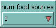
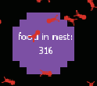
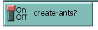
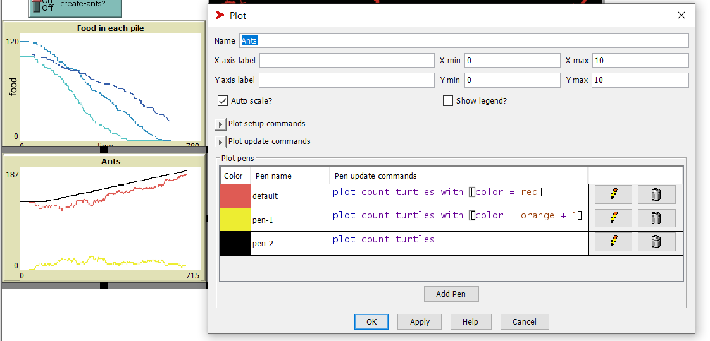
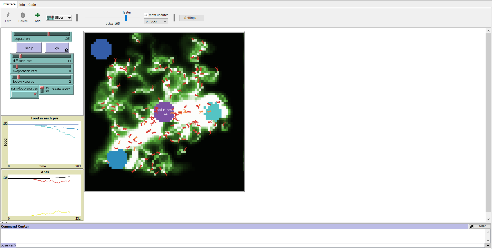

## Комп'ютерні системи імітаційного моделювання
## СПм-23-4, **Романенко Антон**
### Лабораторна робота №**2**. Редагування імітаційних моделей у середовищі NetLogo

### Варіант 10, модель у середовищі NetLogo:
[Ants](https://www.netlogoweb.org/launch#http://www.netlogoweb.org/assets/modelslib/Sample%20Models/Biology/Ants.nlogo)

 

Внесені зміни у вихідну логіку моделі, за варіантом:
Додано можливість вказувати кількість джерел їжі на полі.

Це нововведення дозволяє змінювати кількість доступних джерел їжі, що може впливати на ефективність збору та взаємодії між мурахами.
Завдяки цій зміні можна більше варіювати умови експерименту, оцінюючи, як різна кількість джерел їжі впливає на процеси комунікації та пошуку їжі.

Змінено процедуру setup-food.
Тепер деякі джерела їжі не будуть створюватися, якщо значення на селекторі буде занадто малим.
Це оновлення дозволяє контролювати кількість джерел їжі, що генеруються на полі, зважаючи на задані умови.
Якщо значення селектора не досягає необхідного мінімуму, створення джерел їжі буде обмежене, що допомагає коригувати конфігурацію поля в залежності від потреб експерименту.
<pre>
 to setup-food  ;; patch procedure
  ;; setup food source one on the right
  if (distancexy (0.6 * max-pxcor) 0) < 5 and num-food > 0
  [ set food-source-number 1 ]
  ;; setup food source two on the lower-left
  if (distancexy (-0.6 * max-pxcor) (-0.6 * max-pycor)) < 5 and num-food > 1
  [ set food-source-number 2 ]
  ;; setup food source three on the upper-left
  if (distancexy (-0.8 * max-pxcor) (0.8 * max-pycor)) < 5 and num-food > 2
  [ set food-source-number 3 ]
  ;; set "food" at sources to either 1 or 2, randomly
  if food-source-number > 0
  [ set food one-of [1 2] ]
end
</pre>

Доданий відповідний селектор:

                  
**Додано показник кількості зібраної їжі у гнізді, що відображається користувачеві:**

Створено змінну, яка відповідає за підрахунок принесеної у гніздо їжі:
<pre>
  collected-food
 </pre>

Змінено процедуру go. Тепер на гнізді відображається лічильник їжі:
<pre>
to go  ;; forever button
  ...
  ask patch 4 1 [set plabel "food in nest:"] 
  ask patch 1 -1 [set plabel collected-food]
  ...
end
</pre>

Змінено процедуру return-to-nest. Тепер, якщо мураха несла їжу і повертається у гніздо, лічильник їжі збільшується на одиницю:
 <pre>
to return-to-nest  ;; turtle procedure
  ifelse nest?
  [ 
   ...
    set collected-food collected-food + 1
    rt 180 ]
   ...
end
</pre>

Додано відключаєму можливість появи нових мурах за умов наявності достатньої кількості їжі у гнізді.

Змінено процедуру go. Якщо зібраної їжі більше 10 одиниць, то кожні 10 тіків може бути створена нова мураха. Створення нової мурахи коштує 1 одиницю їжі:
<pre>
to go  ;; forever button
  ...
  if collected-food > 10 and ticks mod 20 = 0 and count turtles < 200 and create-ants?[
   set collected-food collected-food - 1
   create-turtles 1
  [ set size 2         ;; easier to see
    set color red  ]
  ]
...
end
</pre>

Перемикач можливості створення мурах:

Додано графік зміни кількості мурах.

Створено графік для відображення кількості мурах:

Чорний – загальна кількість мурах.
Червоний – мурахи, які шукають їжу.
Жовтий – мурахи, які знайшли їжу і несуть її в гніздо.

Внесені зміни у вихідну логіку моделі, на власний розсуд:
Феромони
У природі мурахи постійно виділяють феромони, незалежно від того, чи знайшли вони їжу.
Враховуючи це, було змінено процедуру look-for-food.
Тепер мурахи, які ще не знайшли їжу, також залишають невелику кількість феромонів — у 15 разів менше, ніж ті, що знайшли їжу.
Це нововведення покращує поведінку мурах: вони частіше слідують одна за одною, залишаються ближче до групи, що забезпечує більш координований рух.
Однак така зміна знижує загальну ефективність збору їжі, що робить модель ближчою до реальних умов.

<pre>
 to look-for-food  ;; turtle procedure
  if food > 0
  [ set color orange + 1     ;; pick up food
    set food food - 1        ;; and reduce the food source
    rt 180                   ;; and turn around
    stop ]
  ;; go in the direction where the chemical smell is strongest
  if (chemical >= 0.05) and (chemical < 2)
  [ uphill-chemical ]
  set chemical chemical + 4
end
</pre>

Кількість їжі в джерелах
Раніше в оригіналі кількість їжі на кожному патчі з їжею визначалась випадково, що додавало невизначеності та елемент випадковості у моделювання.
Для усунення цієї непередбачуваності було додано слайдер, який дозволяє точно задавати кількість одиниць їжі в патчах із їжею.
Для цього змінено процедуру setup-food, яка тепер використовує значення зі слайдера для визначення кількості їжі на кожному патчі.
Це забезпечує більшу контрольованість і повторюваність експериментів.

<pre>
to setup-food  ;; patch procedure
  ;; setup food source one on the right
  if (distancexy (0.6 * max-pxcor) 0) < 5 and num-food-sources > 0
  [ set food-source-number 1 ]
  ;; setup food source two on the lower-left
  if (distancexy (-0.6 * max-pxcor) (-0.6 * max-pycor)) < 5 and num-food-sources > 1
  [ set food-source-number 2 ]
  ;; setup food source three on the upper-left
  if (distancexy (-0.8 * max-pxcor) (0.8 * max-pycor)) < 5 and num-food-sources > 2
  [ set food-source-number 3 ]
  ;; set "food" at sources to either 1 or 2, randomly
  if food-source-number > 0
  [ set food food-in-source ]
end
</pre>

Фінальний код моделі та її інтерфейс доступні за [посиланням](Ants_v2.nlogo). 
 

Обчислювальні експерименти
1. Вплив розміру популяції мурах на збір їжі
Метою експерименту є визначення залежності між розміром популяції мурах у колонії та швидкістю збору їжі. Тривалість кожної симуляції становить 400 тактів.
Експерименти виконуються для кількості мурах від 20 до 200 із кроком 20, загалом 10 симуляцій.

Параметри моделі, встановлені за замовчуванням:
diffusion-rate: 50
evaporation-rate: 10
food-in-source: 2
num-food-sources: 3
create-ants?: увімкнено
На початку кожної симуляції у всіх джерелах їжі сумарно міститься 414 одиниць.
<table>
<thead>
<tr><th>Кількість мурах</th><th>Скільки залишилось їжі у всіх джерелах</th></tr>
</thead>
<tbody>
<tr><td>20</td><td>360</td></tr>
<tr><td>40</td><td>280</td></tr>
<tr><td>60</td><td>255</td></tr>
<tr><td>80</td><td>230</td></tr>
<tr><td>100</td><td>185</td></tr>
<tr><td>120</td><td>170</td></tr>
<tr><td>140</td><td>190</td></tr>
<tr><td>160</td><td>175</td></tr>
<tr><td>180</td><td>165</td></tr>
<tr><td>200</td><td>150</td></tr>
</tbody>
</table>

З аналізу видно, що зі збільшенням чисельності мурашиної колонії кількість залишків їжі в джерелах зменшується.
Це свідчить про те, що більша популяція мурах сприяє більш ефективному збору ресурсів.
Однак після досягнення позначки в 100 мурах подальше збільшення їх кількості вже не дає значного приросту ефективності.
Це пов’язано з тим, що модель обмежує чисельність колонії до 200 особин, і подальше зростання популяції незначно впливає на швидкість збору їжі.