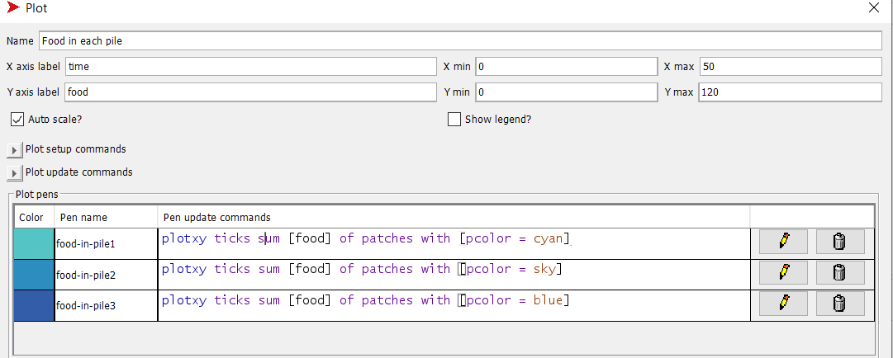
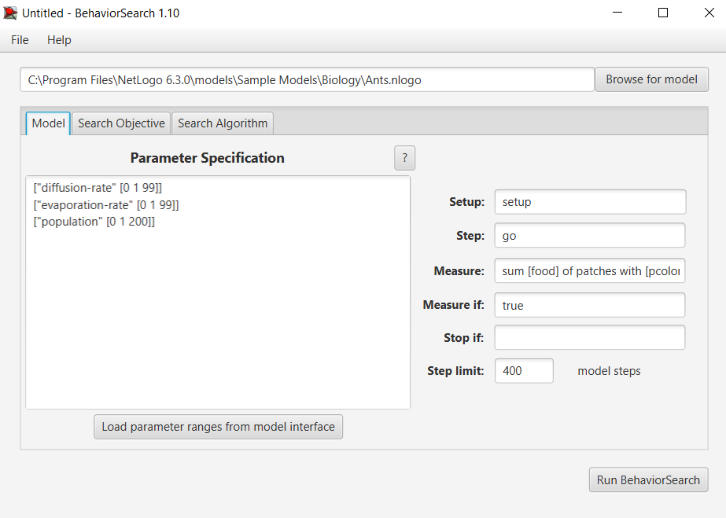
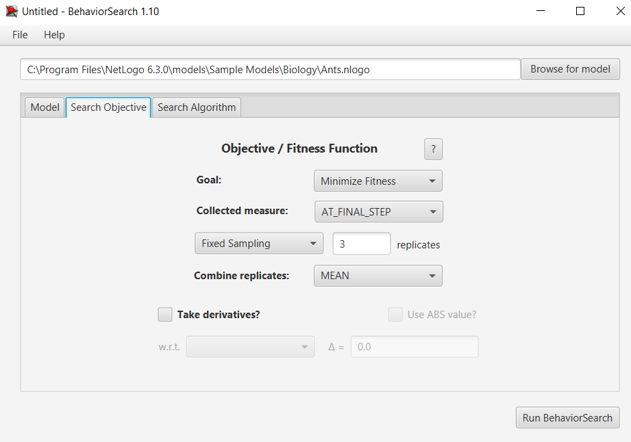
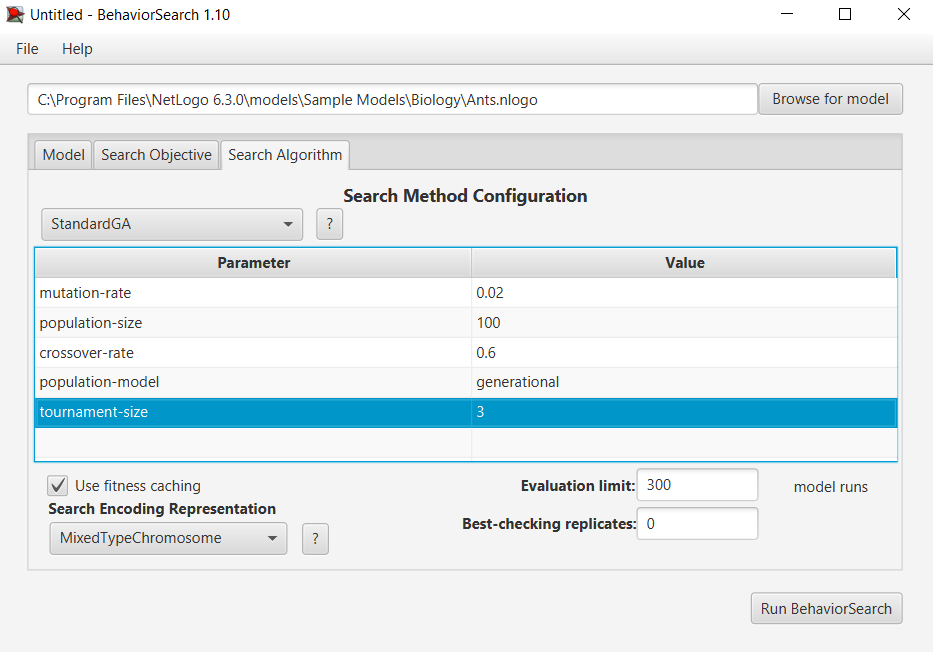
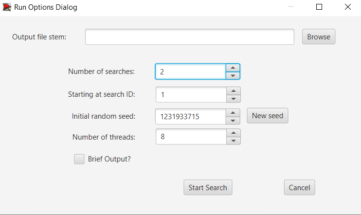
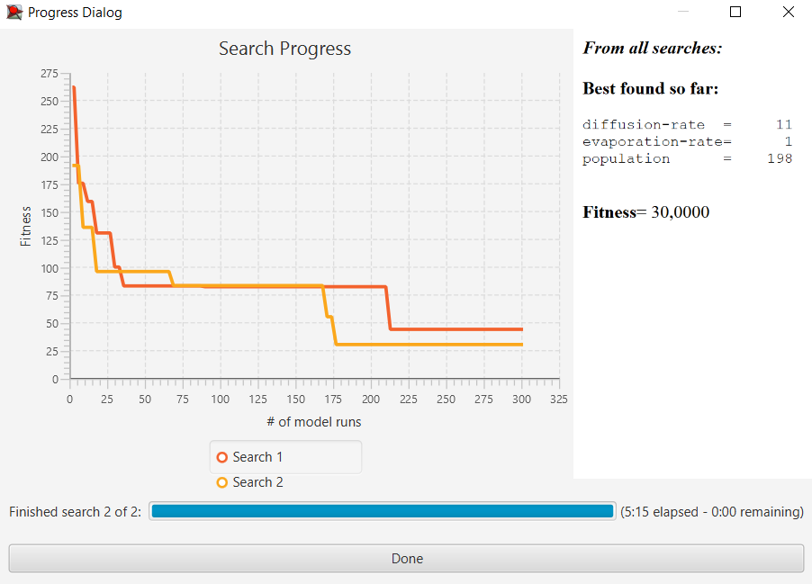
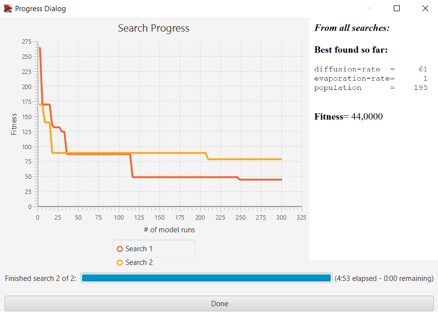

## Комп'ютерні системи імітаційного моделювання
## СПм-23-4, **Романенко Антон**
### Лабораторна робота №**3**. Використання засобів обчислювального интелекту для оптимізації імітаційних моделей

 

### Варіант 10, модель у середовищі NetLogo:

[Ants](https://www.netlogoweb.org/launch#http://www.netlogoweb.org/assets/modelslib/Sample%20Models/Biology/Ants.nlogo)

 

#### Опис моделі:

Модель, що імітує колонію мурах для ефективного збору їжі. Кожна мураха, яка знаходить припаси, керується за рядом простих правил, щоб забезпечити спільну дію колонії. Під час транспортування їжі до гнізда, мурахи використовують феромони, для залишення сліду. Коли інші мурахи реагують на цей хімічний слід, вони слідують за феромоном та, в ідеалі, приєднуються до збору їжі.
 

### Налаштування середовища BehaviorSearch:
**Вибрана модель**:

<pre>
C:\Program Files\NetLogo 6.3.0\models\Sample Models\Biology\Ants.nlogo
</pre>

**Параметри моделі** (вкладка Model):

<pre>
["diffusion-rate" [0 1 99]]
["evaporation-rate" [0 1 99]]
["population" [0 1 200]]
</pre>

Використовувана **міра**:  
Для функції фітнесу було обрано **кількість їжі у всіх джерелах їжі**. Вираз для розрахунку взято з налаштувань графіка аналізованої імітаційної моделі в середовищі NetLogo та вказано у параметрі "**Measure**":

<pre>
sum [food] of patches with [pcolor = cyan] + sum [food] of patches with [pcolor = sky] + sum [food] of patches with [pcolor = blue]
</pre>

Кількість їжі має враховуватись **на останньому кроці**. Тривалість симуляції 400 тактів.
Параметр зупинки за умовою "**Stop if**" не використовувався.

Загальний вигляд вкладки налаштувань параметрів моделі:

**Налаштування цільової функції** (вкладка Search Objective):  
Основноб метою підбору параметрів імітаційної моделі є **мінімізація** кількості їжі в джерелах. "**Goal**" зі значенням **Minimize Fitness**.
Завдання полягає в підборі таких параметрів, за яких мурахи зберуть максимально можливу кількість їжі за визначений час.
Щоб уникнути похибок, пов’язаних із випадковістю, закладеною в логіку моделі, **кожна симуляція проводиться тричі**, а підсумковий результат обчислюється як **середнє арифметичне**.
Загальний вигляд вкладки налаштувань цільової функції:

**Налаштування алгоритму пошуку** (вкладка Search Algorithm):

Загальний вид вкладки налаштувань алгоритму пошуку:

 

### Результати використання BehaviorSearch:

Діалогове вікно запуску пошуку:

Результат пошуку параметрів імітаційної моделі, використовуючи **генетичний алгоритм**:

Результат пошуку параметрів імітаційної моделі, використовуючи **випадковий пошук**:

